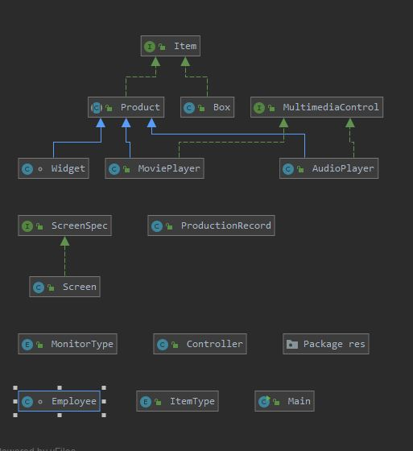

# ProductionLineTracker_Charlie
Functioning production line.

This is a standard production tracker. it takes in products which are entered by a user then classifies them by a generated productID, a product name, manufacturer and by the date registered. You may also choose the amount of products entered if more than 1 (1-10). This program also allows an employee to log in tracking their usage in while using the program.

LINK FOR GENERATED JAVADOC:   file:///C:/Users/Noliano/OneDrive%20-%20Florida%20Gulf%20Coast%20University/ObjectOriented/ProductionLineTracker_Charlie/index.html

 
